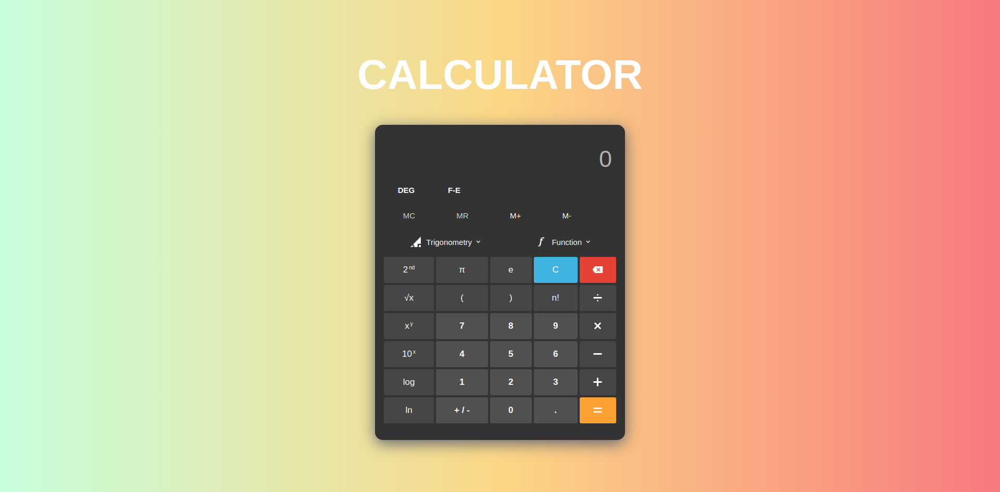
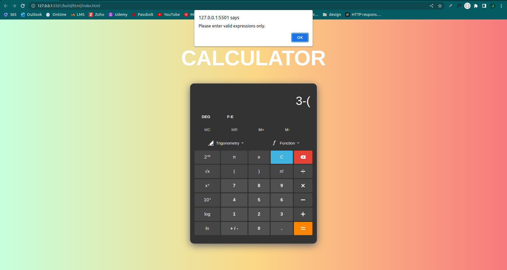

# CALCULATOR

## 📝 Table of Contents

- [AIM](#aim)
- [Usage](#usage)
- [Output](#output)

 

## 🏁 AIM 

Create a calculator using typescript.

 

> ### ⛏️ Pre-requisite

- Typescript
- Javascript
- HTML
- CSS

 

## 🎈 Usage 
Clone the repo using below command: 
<code>$ git clone (web URL)</code> 

 

If you don't have typescript already install, you can run below commands:  
<code>$ npm install -g typescript</code> 

 

Then open the terminal and run the below command: 
<code>$ tsc .src/index.ts</code> 

 

You can even add watch flag to nable TypeScript's watch mode, which continuously monitors for changes and recompiles the code automatically. 
<code>$ tsc .src/index.ts -w</code> 

 

 

## 🎉 Output 
 

<ol>
    <li>Main Page:</li> 
      
    <li>If error occurs:</li> 
      
</ol>

##  ✍️ Author: ISHAN HARKHANI